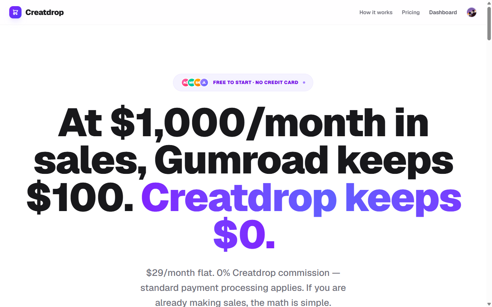

<div align="center">

# Creatdrop

**Sell digital products from your own creator storefront — keep more of every sale**

[creatdrop.com](https://creatdrop.com)&nbsp;&nbsp;·&nbsp;&nbsp;[](https://creatdrop.com)&nbsp;&nbsp;[](#)&nbsp;&nbsp;[](#)

</div>

---

## The problem

Creators selling digital products lose a slice of every sale to platform fees. Gumroad takes 10%+, others bury it in tiers. At $1,000/month in sales that's $100+ gone — every month, forever. The product is yours. The cut shouldn't be.

## What Creatdrop does

Your own storefront at `/u/username`, your own checkout, and **0% Creatdrop commission** (standard payment processing applies).

```
claim storefront → upload product → buyer checks out → file delivered → you keep more
```

Files are delivered through secure, expiring signed URLs. Payments run through your own Paddle checkout — Creatdrop never sits between you and the money.

> 0% commission. $29/month flat. The math is simple.

---

## Screens

<div align="center">

</div>

---

## Roadmap

- [x] Creator storefronts at `/u/username`
- [x] Digital product upload + signed-URL file delivery
- [x] Paddle subscriptions (Pro) + one-time product checkout
- [x] Webhook-driven entitlements — activation, cancellation, refund/chargeback all sync the plan
- [x] Free/Pro limits enforced (5 products free, unlimited on Pro)
- [x] Public marketplace + programmatic SEO blog (80+ pages)
- [ ] License types (personal / commercial / resale)
- [ ] File watermarking & leak detection

## How it's built

Paddle runs as the merchant of record: the server creates the transaction, the Paddle.js overlay handles payment, and **webhooks drive every plan change** (activate, cancel, refund) so entitlements never drift from what was paid.

Files are never served directly — uploads live in Supabase Storage and each purchase mints a short-lived **signed URL**, so a download link can't be shared or replayed.

Auth is Clerk, data is Neon + Prisma, transactional mail is Resend, all on Vercel.

## Stack

Next.js · Clerk · Neon + Prisma · Paddle · Supabase Storage · Resend · Vercel

---

<div align="center">

*Try it live →* [creatdrop.com](https://creatdrop.com)

</div>
